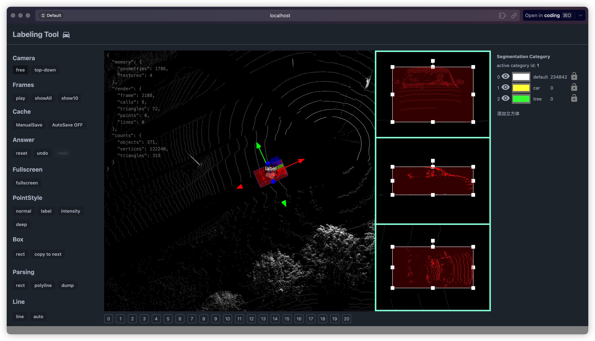

# una-pcl



3D Point Cloud Labeling Tool

一个基于 Web 的 3D 点云标注工具，专注于自动驾驶场景下的点云数据处理与标注。

## 核心特性

- 🚀 高性能点云渲染引擎
- 🎯 精确的 3D 标注工具集
- 🔄 多视角投影与同步
- ⚡️ 实时标注与预览

## 技术栈

- Vue 3 + TypeScript
- Three.js / WebGL
- Tailwind CSS
- Turborepo：Monorepo 架构管理
- Bun：使用 Bun 作为 PackageManager

## 快速开始

[Install Bun](https://bun.sh/docs/installation)

```shell
bun install

bun run dev
```
